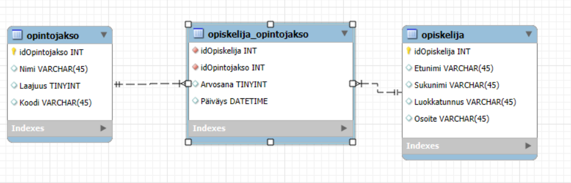

Opintorekisteri REST API

Tämä projekti sisältää mysql tietokannan ja node.js + express sovelluksen jolla voidaan hakea, lisätä, poistaa tai muuttaa (CRUD) taulukkoihin tallennettuja tietoja. 

Tietokanta sisältää kolme taulukkoa:
-opiskelija
-opintojakso
-opiskelija_opintojakso
kuva-> 

Tietokannassa on käytössä kaksi aliohjelmaa joilla voi hakea yhden tai kaikkien kurssien keskiarvot ja toisella voi hakea yhden tai kaikkien opiskelijoiden keskiarvot. 

Linkistä videoon jossa esittely sovelluksesta. 
[katso video](https://unioulu-my.sharepoint.com/:v:/g/personal/tkarsika24_students_oamk_fi/ET4N6JAYO7NIuvcEVRatuDwBOH3BK2G_ZjPYkG37iqW3DQ?nav=eyJyZWZlcnJhbEluZm8iOnsicmVmZXJyYWxBcHAiOiJTdHJlYW1XZWJBcHAiLCJyZWZlcnJhbFZpZXciOiJTaGFyZURpYWxvZy1MaW5rIiwicmVmZXJyYWxBcHBQbGF0Zm9ybSI6IldlYiIsInJlZmVycmFsTW9kZSI6InZpZXcifX0%3D&e=uTFHzv)
